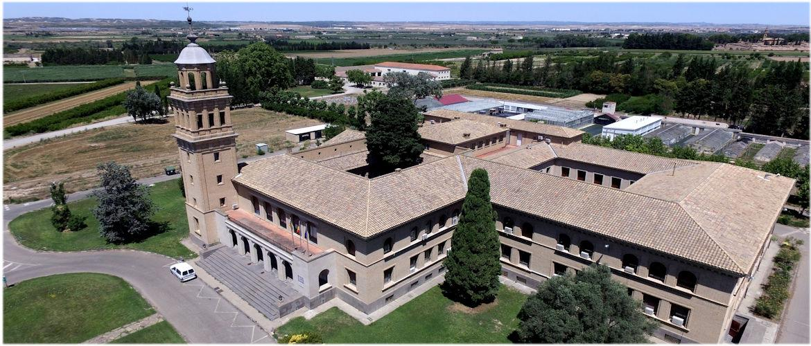

<table align="center" width=100%>
  <tr>
    <td align="center"><b>[Home](index.html)</b>&nbsp;</td>
    <td align="center"><b>[Members](staff.html)</b>&nbsp;</td>
    <td align="center"><b>[Publications](publications.html)</b>&nbsp;</td>
    <td align="center"><b>[Software](software.html)</b>&nbsp;</td>
    <td align="center"><b>[Material educativo](matdidactico.html)</b>&nbsp;</td>
    <td align="center"><a href="https://bioinfoperl.blogspot.com"><b>Blog</b></a>&nbsp;</td>
    <td align="center"></td>
  </tr>
</table>

The Computational & Structural Biology Group at [EEAD-CSIC](http://www.eead.csic.es) has interest in the following research topics:

- (Pan)genomics and transcriptional regulation of grasses
- Evolutionary and structural analysis of ductile proteins (IDPs) and flavoenzymes

    Grupo de Biología Computacional y Estructural
    Estación Experimental Aula Dei-CSIC
    Av. Montañana 1.005, 50059 Zaragoza (Spain)
    phone (+34) 976716089

    

