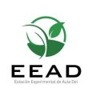

# Laboratory of computational & structural biology

<table align="center" width=100%>
  <tr>
    <td align="center"><b>[Home](index.html)</b></td>
    <td align="center"><b>[Members](staff.html)</b></td>
    <td align="center"><b>[Publications](publications.html)</b></td>
    <td align="center"><b>[Software](software.html)</b></td>
    <td align="center"><b>[Material educativo](matdidactico.html)</b></td>
    <td align="center"></td>
  </tr>
</table>

### Material propio

* [#!/perl/bioinfo](http://bioinfoperl.blogspot.com/): una bitácora sobre programación en bioinformática 

* [Scripting with the Linux shell](https://github.com/eead-csic-compbio/scripting_linux_shell) (2020)

* [Bioinformatics resources and best-practices for plant-breeders](https://eead-csic-compbio.github.io/bioinformatics/) (2021)

* [From genomes to pangenomes: understanding variation among individuals and species](http://eead-csic-compbio.github.io/get_homologues/tutorial/pangenome_tutorial.html) (2020)

* Methods in biostatistics and bioinformatics: [notes](https://github.com/eead-csic-compbio/biostats_bioinfo) & [exercises](https://github.com/eead-csic-compbio/methods_biostats_bioinfo) (2019)

* [barley-agroclimatic-association](https://eead-csic-compbio.github.io/barley-agroclimatic-association) (2018)

* [Algoritmos en bioinformática estructural](http://eead-csic-compbio.github.io/bioinformatica_estructural)
(2008-18) [[PDF](http://digital.csic.es/handle/10261/21892)]

* [Perl en Bioinformática](https://eead-csic-compbio.github.io/perl_bioinformatica/) (2004-17)
    
<!--[Alineamiento de secuencias, estructura secundaria, desorden y filogenias de
proteínas](http://www.eead.csic.es/compbio/material/alineafilog/) (2018)
 -->
<!--[Curso sobre modelado comparativo de proteínas](http://www.eead.csic.es/compbio/material/modelado_comparativo)
(2004-2013)
 -->
<!--[Computational analysis of regulatory
proteins](http://www.eead.csic.es/compbio/material/regulatory_proteins)
(2013) -->
<!--[Programación en clusters
Rocks](http://www.eead.csic.es/compbio/material/programacion_rocks)
(2007-11)
[Taller de (bio)Perl](http://www.eead.csic.es/compbio/material/bioperl/)
(2010)

[Paseo por la
bioinformática](http://www.eead.csic.es/compbio/material/paseo_bioinfo)
([Escuela Nacional Preparatoria](http://dgenp.unam.mx)/UNAM 2007)
[La filosofía *open source* en la
bioinformática](http://www.aragoninvestiga.org/La-filosofia-open-source-en-la-bioinformatica/)
(2009) -->

### Enlaces

* [Reportaje del programa Lab24](http://rtve.es/v/4467805?t=09m16s) sobre
nuestro trabajo en genómica de gramíneas 

* Entrevistas en programa [Ágora](https://www.cartv.es/aragonradio/programas/agora/podcast) sobre
nuestro trabajo: 28/06/2017 (min.33) y 29/06/2017 (min.29) 

* Material sobre filogenias moleculares de [Pablo Vinuesa](https://www.ccg.unam.mx/~vinuesa/Phylogeny_tutorials_PV.html)

<!--* Cómo llegar a [dedicarse a la ciencia](./papers/ComoSerCientifico2007.pdf) (de Fernando Valladares) -->

* [Manual de Comunicación para Investigadores](http://comunicaciencia.unirioja.es) (Universidad de La
Rioja)

* Cómo preparar [material científico en inglés](http://www.nature.com/scitable/ebooks/english-communication-for-scientists-14053993/contents)
(*Nature*)
