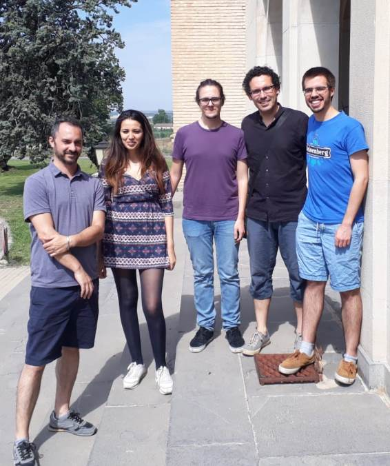
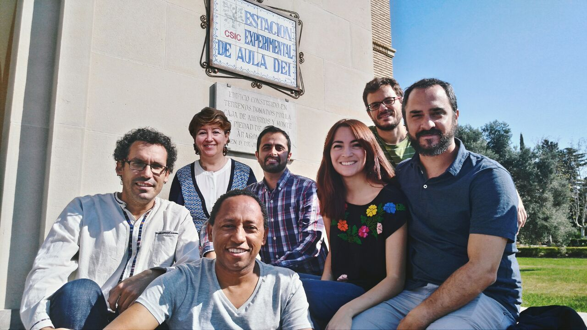

\

laboratory of computational & structural biology
------------------------------------------------

  ----------------------------------- ------------------------------------------------------------------------ ---------------------------------------- ------------------------------------
     [Estación Experimental Aula Dei](http://www.eead.csic.es/)\              [Fundación ARAID](http://www.araid.es)   
                                      [Consejo Superior de Investigaciones Científicas](http://www.csic.es/)                                            
  ----------------------------------- ------------------------------------------------------------------------ ---------------------------------------- ------------------------------------

-   [Home](index.html)
-   [Lab members](staff.html)
-   [Our collaborators](collaborators.html)
-   [Publications](publications_computational_biology_bioinformatics.html)
-   [Software](software_computational_biology_bioinformatics.html)
-   [Material
    educativo](material_didactico_biologia_computacional_bioinformatica.html)

\
\
-   [Bruno Contreras Moreira](https://orcid.org/0000-0002-5462-907X)
    (2007-, at EMBL-EBI since Oct2018)
-   [Inmaculada
    Yruela](http://www.eead.csic.es/home/staffinfo?Id=58) (2011-)
-   [Najla Ksouri](http://www.eead.csic.es/home/staffinfo?Id=501)
    (Sept2015-Oct2016, Apr2018-, PhD co-directed by Y Gogorcena)
-   [María Ángeles
    Decena](http://www.bifi.es/bioflora/research-team.html) (Sep2018-,
    PhD co-directed with Pilar Catalán)

{width="400"}
Álvaro (first from the right), Bruno, Chesco, Najla and Carlos in June,
2018
\
{width="400"}
The group pictured in September, 2017
\
### Previous members / visitors of the lab {#previous-members-visitors-of-the-lab style="text-align:left"}

-   [Carlos P.
    Cantalapiedra](https://scholar.google.com/citations?user=fa8RszgAAAAJ)
    (Jul-Nov2010,Sep2011-Sep2015,Feb2016-Sep2018,
    [PhD](https://dialnet.unirioja.es/servlet/tesis?codigo=120706)
    co-directed by A Casas)
-   [Rubén Sancho Cohen](http://www.bifi.es/bioflora/research-team.html)
    (Jan2014-Sep2018, PhD co-directed with Pilar Catalán)
-   [Francesc Montardit
    Tardá](http://www.eead.csic.es/home/staffinfo?Id=587)
    (Sept2017-Oct2018, MSc co-directed by Y Gogorcena)
-   [Dr. Valerie de
    Anda](https://scholar.google.es/citations?user=Bom_ztkAAAAJ&hl=es)
    (Jul2014, Oct2016-Aug2018, PhD Candidate at Inst
    Ecología-UNAM, México)
-   Álvaro Rodríguez del Río (Feb2018-Jul2018, [MSc RU
    Groningen](http://fse.studenttheses.ub.rug.nl/18035/), local
    supervisors: B Contreras & AM Casas, see [bitscore normalization
    benchmark](https://github.com/eead-csic-compbio/get_homologues/tree/master/user_utils/normalize))
-   Uriel Alonso Hurtado Páez (Jul2017-Nov2017, PhD Candidate at
    Universidad Nacional, Colombia)
-   Teshome Dagne Mulugeta (Abr2017-May2017,Sept2017-Nov2017), PhD
    Candidate at [NMBU](https://www.nmbu.no/ans/teshome.mulugeta),
    [summary](https://norbis.w.uib.no/learning-advanced-analysis-of-gene-regulation-in-zaragoza)
-   Eduardo Candeal (Abr2016-May2016; Sept2016-Jan2017), employee of
    [BDR diagnostics](http://www.bdrdiagnostics.com)
-   María Jesús García-Pereira (Sept2013-Sept2014)\
    Postdoc contract.
-   Edgar Fernández Alons (Feb-Dec 2014)\
    MSc project supervised by I Yruela.
-   [Dr. Pablo
    Vinuesa](https://scholar.google.es/citations?user=8IpvaDQAAAAJ&hl=es)
    (Centro de Ciencias Genómicas, México, Jun2014)\
    Two-week visit as part of bilateral funding E2014MX010.
-   [Dr. Edgardo
    Jofré](https://www.researchgate.net/profile/Edgardo_Jofre) (UNRC
    Argentina, Sep2013)\
    One-month visit as part of bilateral funding PRI-AIBAR-2011-0840.
-   Anais Ariza Jiménez (Jul-Aug2013)\
    Student project on 'Transcriptional regulation of chloroplast
    genes', supported by [CSIC
    JAE-intro](https://sede.csic.gob.es/jae-intro-cp-2013) program.
-   [Dr. Daniela
    Medeot](https://www.researchgate.net/profile/Daniela_Medeot) (UNRC
    Argentina, Jun-Jul2013)\
    One-month visit as part of bilateral funding PRI-AIBAR-2011-0840.
-   [Dr. Álvaro
    Sebastián](https://scholar.google.com/citations?user=LTAbijoAAAAJ)
    (Sept2009-Dec2012)\
    Postdoc hired in STREG project, founder of
    [sixthresearcher](http://www.sixthresearcher.com).
-   Walter Ferrari (UNRC Argentina, Aug-Oct2012)\
    Two-month visit as part of bilateral funding PRI-AIBAR-2011-0840.
-   Fernando Rossi (UNRC Argentina, Jun2012)\
    One-month visit as part of bilateral funding PRI-AIBAR-2011-0840.
-   Dr. Lorenz Bülow (TU Braunschweig, Aug-Sep2011)\
    Short-term visit during the STREG project.
-   Dr. José Ramón Blas Pastor (Universidad de Castilla La Mancha,
    Mar2011)\
    Short visit to learn sequence analysis skills for his studies on
    molecular evolution, funded by [UCLM](http://www.crib.uclm.es).
-   David Zamorano (Oct2009-Jun2010)\
    Postgraduate topic on 'Structural and functional prediction of
    proteins: analysis of protein-DNA interactions', funded by
    [UNAM](http://www.unam.mx).
-   Gökhan Karakülah (Nov2008-Jun2009)\
    First year of PhD in Bioinformatics, funded by [CSIC JAE
    predoc](https://sede.csic.gob.es/servicios/formacion-y-empleo/formacion-de-personal-investigador) program.
-   Odín Morón García (Jul-Oct2008)\
    Student project on 'Evaluation of methods of gene orthology
    assignment', funded by [CSIC Introduction to
    research](https://sede.csic.gob.es/servicios/formacion-y-empleo/formacion-de-personal-investigador) program.

