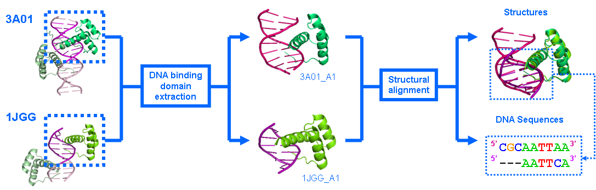

<table align="center" width=100%>
  <tr>
    <td align="center"><b>[Home](index.html)</b>&nbsp;</td>
    <td align="center"><b>[Members](staff.html)</b>&nbsp;</td>
    <td align="center"><b>[Publications](publications.html)</b>&nbsp;</td>
    <td align="center"><b>[Software](software.html)</b>&nbsp;</td>
    <td align="center"><b>[Material educativo](matdidactico.html)</b>&nbsp;</td>
    <td align="center"></td>
  </tr>
</table>

### TFcompare 

TFcompare is a tool for structural alignment of DNA motifs and protein domains from DNA-binding protein complexes.

It is now available as a Docker container at https://hub.docker.com/repository/docker/eeadcsiccompbio/tfcompare 

This replaces the Web server at http://floresta.eead.csic.es/tfcompare 

