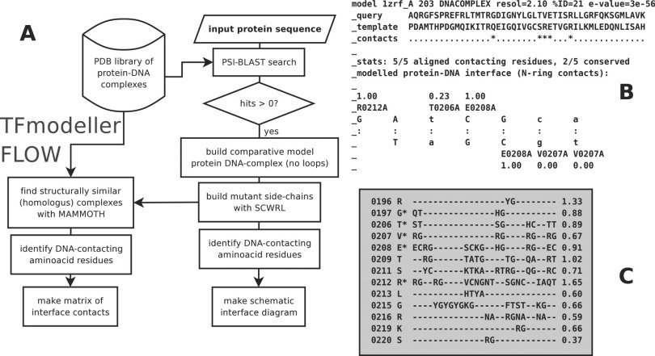

<table align="center" width=100%>
  <tr>
    <td align="center"><b>[Home](https://www.eead.csic.es/compbio/index.html)</b>&nbsp;</td>
    <td align="center"><b>[Members](https://www.eead.csic.es/compbio/staff.html)</b>&nbsp;</td>
    <td align="center"><b>[Publications](https://www.eead.csic.es/compbio/publications.html)</b>&nbsp;</td>
    <td align="center"><b>[Software](https://www.eead.csic.es/compbio/software.html)</b>&nbsp;</td>
    <td align="center"><b>[Material educativo](https://www.eead.csic.es/compbio/matdidactico.html)</b>&nbsp;</td>
    <td align="center"><a href="http://bioinfoperl.blogspot.com"><b>Blog</b></a>&nbsp;</td>
    <td align="center"></td>
  </tr>
</table>

### TFmodeller 

TFcompare is a tool for comparative modelling of protein-DNA complexes.

It is now available as a Docker container at https://hub.docker.com/r/eeadcsiccompbio/tfmodeller 

This replaces the Web server at www.ccg.unam.mx/tfmodeller

